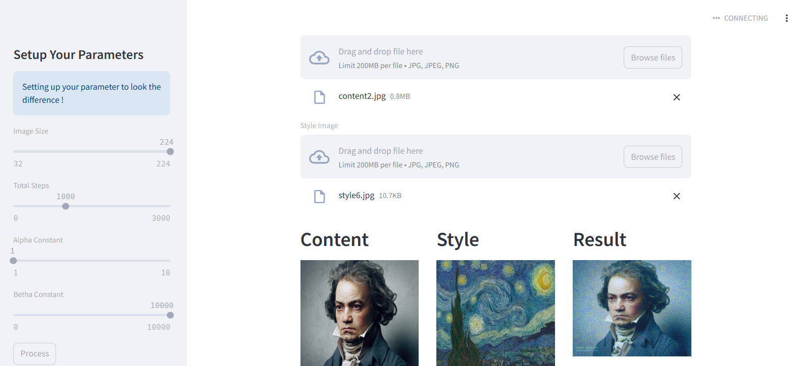

### Neural Style Transfer - PyTorch 

## Introduction
Neural Style Transfer is a technique to combine 2 images (content image and style image) and output combined image. This project leverages pretrained-model VGG19 for feature extraction and streamlit for the web app.

## Models
Model that we use is VGG19 for feature extraction, for further implementation of this model, you can see on model.py file.

## Results

For the implementation of this project. You can run locally ```streamlit run app.py```, or as you can see below for the result.

